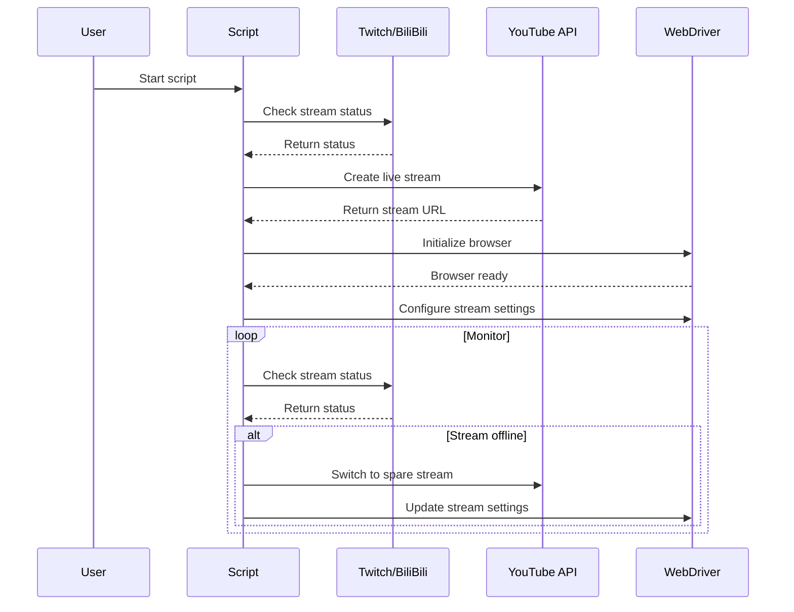
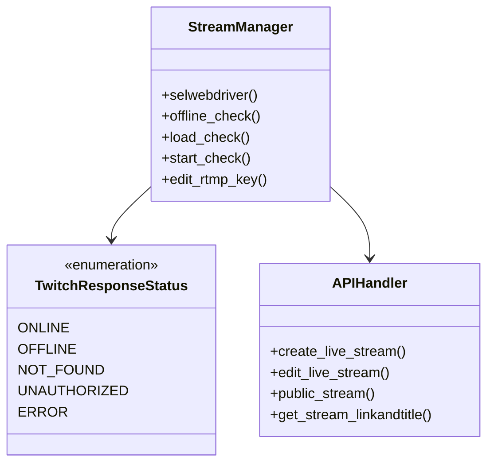
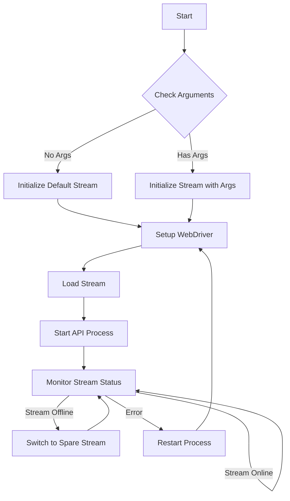

<h1 align="center" id="title">Twitch and BiliBili Archive to YouTube Script</h1>

<h2>🛡️ License:</h2>

PLEASE CREDIT ME ON YOUR CHANNEL WHEN USING(channel description or video description) paste the github link  
[https://bit.ly/archivescript](https://bit.ly/archivescript)

<h2>🛡️ License Example:</h2>

[https://www.youtube.com/@FilianVODSArchive](https://www.youtube.com/@FilianVODSArchive)

[https://www.youtube.com/@NeuroVerseUnofficalVODS](https://www.youtube.com/@NeuroVerseUnofficalVODS)

[https://www.youtube.com/@CaseOhUnofficalVODS](https://www.youtube.com/@CaseOhUnofficalVODS)

<h2>🚨 Warning:</h2>

This script is not in a complete finish state and only support WINDOWS

<h2>🚀 installation guide</h2>

[https://www.youtube.com/watch?v=8YztEWL-ilU](https://www.youtube.com/watch?v=8YztEWL-ilU)
  
<h2>🧐 Features</h2>

Here're some of the project's best features:

*   Archive and play back twitch stream in real time
*   Save VODS forever (unless YouTube delete it)
*   It is automated no need for human
*   Don't need to download the vods and upload it back to youtube
*   WHATEVER LANGUAGE IS SUPPORTED USING THIS SCRIPT

<h2>🛠️ Installation Steps:</h2>

1. Watch the video

2. Enjoy

<h2>🍰 Contribution:</h2>

Make an issue when there a bug

<h2>🤔💭 Q&A</h2>  

> Q1: Why would I needed to create youtube and twitch api?
> 
A1: The youtube api is for creating streams and edit title it is a more effective method than automated chrome.

A2: Twitch api is use for getting the title from streamers maybe i will make a no need for that.

>  Q2: Why is there no guide for bilibili streams?
> 
A: I think no one will use bilibili, maybe i will make another video for that.
  
<h2>💻 Built with</h2>

Technologies used in the project:

*   Streamlink
*   Python
*   Selenium Chromedriver
*   YouTube data api v3
*   Twitch api
*   ffmpeg

<h2>🔜 Future Update(not promising):</h2> 

* Simplify the code
* Make a mode that don't use any api
* Make a gui for installation and automation
* Make a mode the use independent webdriver.exe
* Using a different browers
* Add Kick/Add YouTube??(Needed support on streamlink)

<h2>📈 Diagram about how the script works by sourcery-ai</h2>

<!-- Generated by sourcery-ai[bot]: start review_guide -->

`check_tv.py`, which is designed to manage and monitor live streams on Twitch and BiliBili, and to interact with the YouTube API for stream management. The script includes functionalities for starting, monitoring, and editing live streams, as well as handling stream downtime and switching between different stream sources.

#### Sequence diagram for stream initialization and monitoring

#### Class diagram for stream management components

#### Flow diagram for main stream management process

<!-- Generated by sourcery-ai[bot]: end review_guide -->
